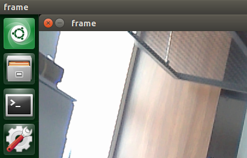

# Live Object Detection and Distance Measurement with RPLidar and MIPI Camera

This project is conducted on Jetson Nano and by using RPLidar and MIPI Camera. It is a library that returns the distance of the object at the point clicked on the video output.

## Libraries and Installation

The libraries used in this project are [pynput](https://pypi.org/project/pynput/), [PyRPlidar](https://pypi.org/project/pyrplidar/), [argparse](https://docs.python.org/3/library/argparse.html),  [numpy](https://pypi.org/project/numpy/) and [jetson.inference and jetson.utils](https://github.com/dusty-nv/jetson-inference).
```bash
pip3 install pynput
pip3 install pyrplidar
pip3 install argparse
pip3 install numpy
```
You can find how to install jetson.inference and jetson.utils [here](https://github.com/dusty-nv/jetson-inference).

## Usage
```bash
python3 detectingObjectsAndMeasuringDistance.py
```
In this project, my aim was integrating RPLidar and MIPI Camera. MIPI Camera has a 60° view angle and I optimized it with RPLidar by using some mathematical expressions. In my experiment, the center of the camera was at 270° of the RPLidar. After optimization is completed, this project returns the type of object, distance of the object and the pixel coordinates of screen where the mouse is clicked. To stop the RPLidar after the demonstration, right-click will work.

## Functions
In this project, we have 2 thread objects running together, which are camera input-output and on_click listener.

### on_click Listener
The function on_click enables us to select any point on the screen with mouse click.

### Camera Input-Output
Since I use Gstreamer, I can get camera input and output as:
```python
input = jetson.utils.videoSource(opt.input_URI, argv=sys.argv)
output = jetson.utils.videoOutput(opt.output_URI, argv=sys.argv+is_headless)
```
## Offset
You can see that there is offset in the loop for detections, which is because of the location of the video output on the screen. The mouse listener that I use is working with the principle of the pixel coordinates on the screen. Coordinates of the upper corner of the screen is (0,0); however, the video output appeared on the screen is not starting at (0,0), but at (66,53) for my screen.  In order to optimize it, adding offset according to the location of video output in your screen will work. 




Here, you can see where the video is located in my screen.


